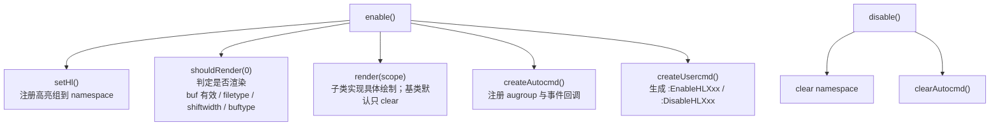
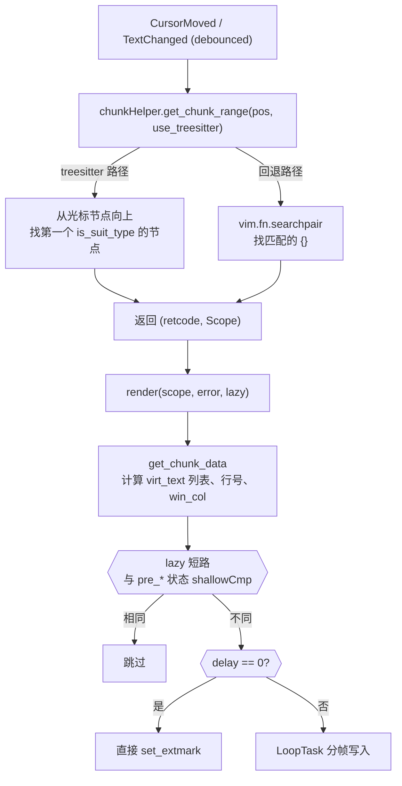

# ARCHITECTURE.md

本文档描述 hlchunk.nvim 的模块分层、数据流与扩展点。

## 分层总览

```mermaid
flowchart TD
    UC["用户配置 (setup)"] --> INIT["init.lua · require 各 mod"]
    INIT --> MODS

    subgraph MODS["mods 层"]
        direction LR
        BASE["BaseMod"]
        CHUNK["ChunkMod"]
        INDENT["IndentMod"]
        LINENUM["LineNumMod"]
        BLANK["BlankMod"]
        BASE -. 继承 .-> CHUNK
        BASE -. 继承 .-> INDENT
        BASE -. 继承 .-> LINENUM
        INDENT -. 继承 .-> BLANK
    end

    MODS --> UTILS

    subgraph UTILS["utils 层"]
        direction LR
        UNODES["class · scope · cache · timer<br/>cFunc(FFI) · indentHelper · chunkHelper<br/>filetype · position · loopTask · ts_node_type"]
    end

    UTILS --> NVIM["Neovim API<br/>extmark · autocmd · namespace · hl"]
```

依赖方向严格自上而下。utils 之间可互相 require，但 mods 不应反向依赖具体子类。BlankMod 继承 IndentMod 是当前唯一的跨 mod 继承。

## 入口与 mod 加载

`lua/hlchunk/init.lua:10` 的 `setup(userConf)` 遍历用户配置表，对每个 `enable == true` 的条目：

1. `require("hlchunk.mods." .. mod_name)` 取得该 mod 的 class
2. 以用户配置构造实例：`Mod(user_conf)`（构造函数内部会 merge 默认配置生成 `XxxConf`）
3. 调用 `mod:enable()` 进入生命周期

因此新增 mod 的最低要求：在 `lua/hlchunk/mods/<name>/` 下提供 `init.lua`（导出继承 BaseMod 的 class）与 `<name>_conf.lua`（导出继承 BaseConf 的 class）。

## BaseMod 生命周期

定义于 `lua/hlchunk/mods/base_mod/init.lua`。所有 mod 共享此骨架：

`shouldRender` 的过滤条件（顺序）：buf 无效 → conf.enable=false → filetype 在 exclude_filetypes → shiftwidth=0 → buftype 属于 help/nofile/terminal/prompt。

子类按需 override：`render`、`createAutocmd`（先调 `BaseMod.createAutocmd(self)` 再追加自己的 autocmd）、`disable`（先清理自身资源再调基类）。

## BaseConf 与配置二元模式

`lua/hlchunk/mods/base_mod/base_conf.lua` 定义基类。每个 mod 提供：

- `UserXxxConf`：用户传入的、字段全 optional 的类型（用于 `---@param`）
- `XxxConf`：merge 默认值后的、字段全 required 的类型（内部使用）

构造函数用 `vim.tbl_deep_extend("force", default, conf or {})` 合并，然后调 `BaseConf.init(self, conf)`。

## 各 mod 职责

| mod | 文件 | 职责 | 关键依赖 |
|-----|------|------|---------|
| chunk | `mods/chunk/` | 高亮光标所在代码块；treesitter 范围优先，括号匹配回退；支持动画渲染 | chunkHelper, loopTask, timer |
| indent | `mods/indent/` | 每行缩进画竖线；按可视范围 + ahead_lines 增量渲染；带缓存 | indentHelper, cache, timer |
| line_num | `mods/line_num/` | 高亮 chunk 范围内的行号 | chunkHelper |
| blank | `mods/blank/` | 在缩进位置画点缀字符（如 `․`）；复用 indent 的渲染骨架 | 继承 IndentMod |

## 关键数据流：chunk 渲染

以最复杂的 chunk mod 为例（见 `mods/chunk/init.lua`）：

`CHUNK_RANGE_RET` 枚举区分 OK / CHUNK_ERR（块内有语法错误，画红）/ NO_CHUNK / NO_TS。

## 关键数据流：indent 增量渲染

indent mod 不重画全 buffer，而用三层 Cache 做增量（`mods/indent/init.lua`）：

- `indent_cache(bufnr, line)`：每行的缩进值
- `pos2id(bufnr, line, col)`：已存在的 extmark id，避免重复 set
- `pos2info(bufnr, line, col)`：virt_text 内容

`narrowRange` 利用 cache 跳过已渲染行；非 lazy 模式（文本变更）会清空整 buffer 缓存重画。这是性能核心，改动时务必保持缓存一致性。

## utils 速查

| 文件 | 用途 |
|------|------|
| `class.lua` | 极简 OOP：`class(ctor)` 建基类，`class(base, ctor)` 继承；`__call` 语法构造 |
| `scope.lua` | 行范围值对象（bufnr/start/finish，0-index 闭区间）。注意是工厂函数不是 class |
| `position.lua` | 光标位置值对象 + `get_char_at_pos` |
| `cache.lua` | 任意键层级的嵌套 table 缓存，构造时声明键名 |
| `timer.lua` | setTimeout/setInterval/debounce/debounce_throttle/throttle |
| `loopTask.lua` | 按时间策略（linear）分帧执行回调，用于 chunk 动画 |
| `cFunc.lua` | FFI 直调 Neovim C：get_indent / get_sw / get_line / skipwhite（性能热点） |
| `indentHelper.lua` | 计算每行虚拟缩进（支持 treesitter 与 virt_indent 推断空行） |
| `chunkHelper.lua` | 求当前 chunk 范围 + 字符串/范围工具 |
| `filetype.lua` | 全局 exclude_filetypes 名单 |
| `ts_node_type/` | 各语言视为「chunk」的 treesitter 节点类型白名单 |

## 扩展点

### 新增一个 mod

1. 建 `lua/hlchunk/mods/<name>/init.lua` 与 `<name>_conf.lua`
2. init 导出 `class(BaseMod, constructor)`；构造函数内 `BaseMod.init(self, conf, meta)` 后设置 default_meta 与 `self.conf = XxxConf(conf)`
3. conf 导出 `class(BaseConf, function(self, conf) ... BaseConf.init(self, conf) end)`
4. override 需要的 `render` / `createAutocmd`
5. 在 `lua/hlchunk/init.lua:3` 的 `---@class HlChunk.UserConf` 加字段
6. 补 `test/features/<name>_spec.lua` 与 `docs/{en,zh_CN}/<name>.md`

### 新增语言支持

在 `lua/hlchunk/utils/ts_node_type/` 新建 `<lang>.lua` 返回 `{ [node_type] = node_type }` 表，然后在 `init.lua` 注册 `M.<lang> = require(...)`。未注册的语言走 `M.default` 的正则匹配。

## 索引约定

- API 层（nvim_buf_*、Scope、Pos）：row/col 0-index
- vim.fn 层（line()、searchpair()、win_get_cursor）：1-index
- chunkHelper / indentHelper 内部统一 0-index；与 fn 交互处显式 ±1
